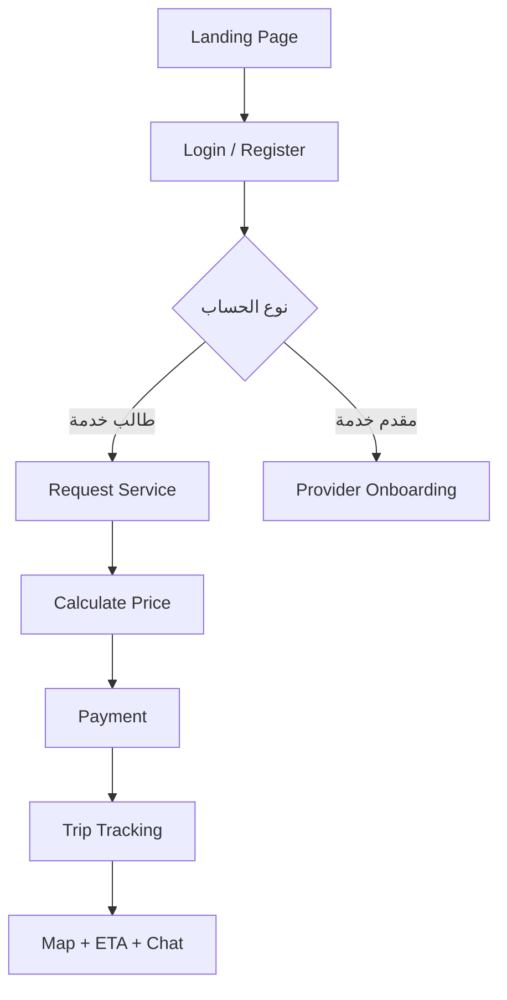

# Mockup - Rafiq Platform

هذا الملف مخصص لتجميع صور الموك اب ومخطط التدفق داخل GitHub.

## أماكن صور الموك اب
ضع الصور داخل نفس المجلد (`Stage 2/`) أو مجلد `Stage 2/assets/` ثم حدّث الروابط أدناه.

### 1) الصفحة الرئيسية

### 2) تسجيل الدخول

### 3) إنشاء حساب

### 4) طلب الخدمة

### 5) كن رفيقًا

### 6) متابعة الرحلة

## UX Flow (Mermaid)

## ملاحظات
- GitHub يعرض Mermaid مباشرة داخل Markdown.
- إذا ما ظهرت الصور، تأكد من مسار الملفات داخل الريبو.
- يفضل تسمية الصور بدون مسافات لتجنب مشاكل الروابط.
