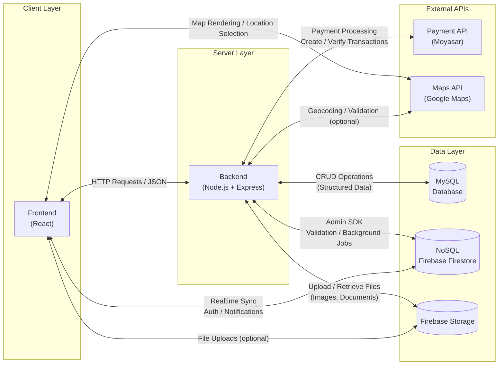

# MVP System Architecture
## High-Level Package Diagram (Three-Layer Architecture)

# High-Level Architecture Diagram

## Architecture Overview

The system is designed as a full-stack web platform following a three-layer architecture that ensures scalability, maintainability, and clear separation of concerns.

The architecture consists of a client layer for user interaction, a server layer for business logic and system operations, and a data layer for data persistence and real-time services.

### System Components

| Component | Technology | Description |
|----------|------------|-------------|
| Frontend | React | Single Page Application (SPA) responsible for rendering the user interface and handling user interactions |
| Backend | Node.js (Express.js) | RESTful API server responsible for business logic, request validation, authentication, and integrations |
| Database (SQL) | MySQL | Relational database used for structured and transactional data |
| Database (NoSQL) | Firebase Firestore | NoSQL database used for real-time synchronization, notifications, and lightweight data |
| File Storage | Firebase Storage | Cloud-based storage for images, documents, and user-uploaded files |
| Authentication (Primary) | JWT (Backend) + OTP (MySQL) | Primary authentication and session/token validation handled by backend APIs |
| Authentication (Secondary) | Firebase Authentication | Secondary/optional authentication provider, not the core authentication path |
| Payment Gateway | Moyasar | Secure payment processing for Visa, MasterCard, and Mada |
| Maps Service | Google Maps API | Map rendering, location selection, geocoding, and route/location utilities |

### Architectural Principles

- **Separation of Concerns:** Each layer is responsible for a specific set of tasks, reducing coupling between components.
- **Scalability:** The backend and data layers can scale independently based on system load.
- **Security:** Primary authentication is handled by backend JWT + OTP verification; Firebase Authentication is optional/secondary.
- **Extensibility:** The architecture allows for easy integration of additional services and features in future phases.
