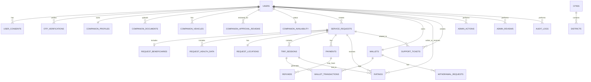

## Tables and Attributes

### users
- id (PK)
- first_name
- last_name
- mobile (UNIQUE)
- email (UNIQUE)
- password_hash
- account_type (user / companion / admin)
- account_status (inactive / active / suspended / pending_verification)
- last_login_at
- created_at
- updated_at

### user_consents
- id (PK)
- user_id (FK -> users.id)
- consent_type (terms / privacy)
- consent_version
- accepted_at
- created_at

### otp_verifications
- id (PK)
- user_id (FK -> users.id)
- channel (mobile / email)
- otp_code_hash
- expires_at
- verified_at
- attempts_count
- status (pending / verified / expired / failed)
- created_at

### companion_profiles
- id (PK)
- user_id (FK -> users.id, UNIQUE)
- gender
- nationality
- date_of_birth
- city
- district
- short_description
- experience_summary
- health_status
- has_car
- created_at
- updated_at

### companion_documents
- id (PK)
- user_id (FK -> users.id)
- document_type
- file_url
- status
- review_note
- reviewed_by_admin_id (FK -> users.id)
- reviewed_at
- created_at

### companion_vehicles
- id (PK)
- user_id (FK -> users.id)
- car_type
- car_model
- plate_number
- created_at
- updated_at

### companion_approval_reviews
- id (PK)
- user_id (FK -> users.id)
- profile_completed
- documents_completed
- approval_status (pending / approved / rejected)
- rejection_reason
- approved_by_admin_id (FK -> users.id)
- approved_at
- created_at
- updated_at

### companion_availability
- id (PK)
- user_id (FK -> users.id, UNIQUE)
- connection_status (online / offline)
- work_status (available / unavailable)
- updated_at

### service_requests
- id (PK)
- user_id (FK -> users.id)
- request_for (self / other)
- service_type
- request_mode (instant / scheduled)
- with_car
- status
- scheduled_at
- created_at
- updated_at

### request_beneficiaries
- id (PK)
- request_id (FK -> service_requests.id)
- full_name
- age
- mobile
- gender
- relationship
- created_at

### request_health_data
- id (PK)
- request_id (FK -> service_requests.id)
- health_condition
- other_text
- created_at

### request_locations
- id (PK)
- request_id (FK -> service_requests.id)
- pickup_city
- pickup_district
- pickup_street
- pickup_building_number
- pickup_apartment_number
- pickup_short_address
- pickup_lat
- pickup_lng
- destination_city
- destination_district
- destination_street
- destination_building_number
- destination_apartment_number
- destination_short_address
- destination_lat
- destination_lng
- created_at

### trip_sessions
- id (PK)
- request_id (FK -> service_requests.id)
- companion_id (FK -> users.id)
- status
- started_at
- ended_at
- created_at

### payments
- id (PK)
- request_id (FK -> service_requests.id)
- user_id (FK -> users.id)
- amount
- status (pending / paid / failed / refunded)
- provider_transaction_id
- paid_at
- created_at

### refunds
- id (PK)
- payment_id (FK -> payments.id)
- amount
- status (pending / completed / failed)
- reason
- refunded_at
- created_at

### wallets
- id (PK)
- companion_id (FK -> users.id, UNIQUE)
- available_balance
- monthly_earnings
- status
- created_at
- updated_at

### wallet_transactions
- id (PK)
- wallet_id (FK -> wallets.id)
- trip_session_id (FK -> trip_sessions.id)
- transaction_type (earning / withdrawal / adjustment)
- amount
- net_profit
- status (pending / completed)
- created_at

### withdrawal_requests
- id (PK)
- wallet_id (FK -> wallets.id)
- amount
- bank_name
- iban
- status (pending_admin / approved / rejected / transferred)
- reviewed_by_admin_id (FK -> users.id)
- reviewed_at
- created_at

### ratings
- id (PK)
- request_id (FK -> service_requests.id)
- trip_session_id (FK -> trip_sessions.id)
- user_id (FK -> users.id)
- companion_id (FK -> users.id)
- stars
- comment
- created_at

### support_tickets
- id (PK)
- user_id (FK -> users.id)
- request_id (FK -> service_requests.id, NULLABLE)
- ticket_type (complaint / suggestion / inquiry)
- subject
- message
- status (open / in_progress / closed)
- created_at
- updated_at

### admin_actions
- id (PK)
- admin_user_id (FK -> users.id)
- target_type (user / companion / withdrawal / document / request)
- target_id
- action_type (approve / reject / suspend / activate / refund / review)
- notes
- created_at

### admin_reviews
- id (PK)
- companion_id (FK -> users.id)
- review_status (pending / approved / rejected)
- reviewed_by_admin_id (FK -> users.id)
- review_note
- reviewed_at
- created_at

### audit_logs
- id (PK)
- actor_user_id (FK -> users.id)
- action
- entity_type
- entity_id
- metadata
- created_at

### service_types
- id (PK)
- name
- is_active
- created_at

### health_conditions
- id (PK)
- name
- is_active
- created_at

### cities
- id (PK)
- name
- is_active

### districts
- id (PK)
- city_id (FK -> cities.id)
- name
- is_active

## Relationships

- users 1 -> N user_consents
- users 1 -> N otp_verifications
- users 1 -> 1 companion_profiles
- users 1 -> N companion_documents
- users 1 -> N companion_vehicles
- users 1 -> N companion_approval_reviews
- users 1 -> 1 companion_availability
- users 1 -> N service_requests
- service_requests 1 -> 0..1 request_beneficiaries
- service_requests 1 -> N request_health_data
- service_requests 1 -> 1 request_locations
- service_requests 1 -> N trip_sessions
- service_requests 1 -> N payments
- payments 1 -> N refunds
- users (companion) 1 -> 1 wallets
- wallets 1 -> N wallet_transactions
- wallets 1 -> N withdrawal_requests
- trip_sessions 1 -> N wallet_transactions
- service_requests 1 -> N ratings
- trip_sessions 1 -> N ratings
- users 1 -> N ratings
- users 1 -> N support_tickets
- service_requests 1 -> N support_tickets (optional)
- users (admin) 1 -> N admin_actions
- users (admin) 1 -> N admin_reviews
- users 1 -> N audit_logs
- cities 1 -> N districts

## ER Diagram

