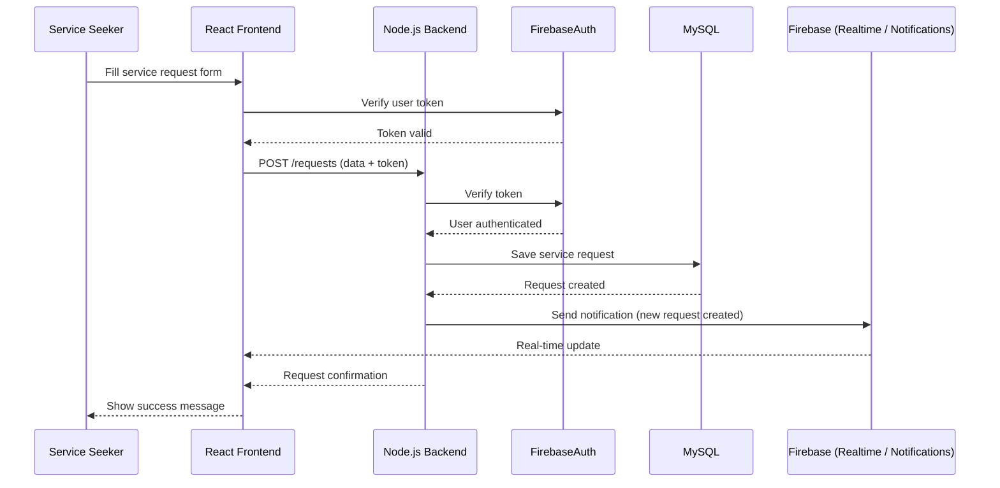
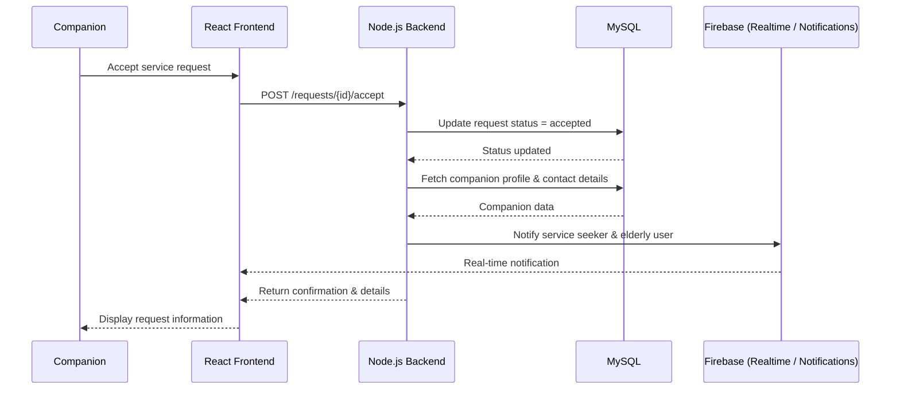
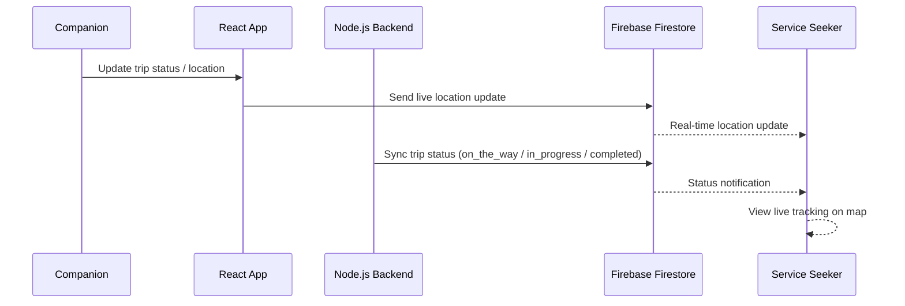

# High-Level Sequence Diagrams

## Use Case: Create Service Request (Service Seeker Requests Assistance)

## Use Case: Accept Request & Share Companion Details

## Use Case: Real-Time Trip Tracking (Family Monitoring)
 

