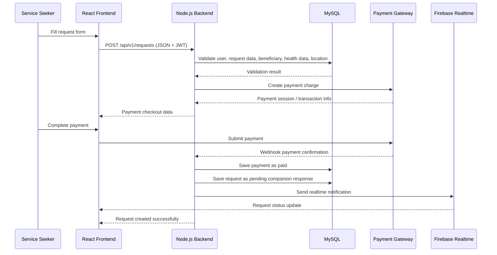
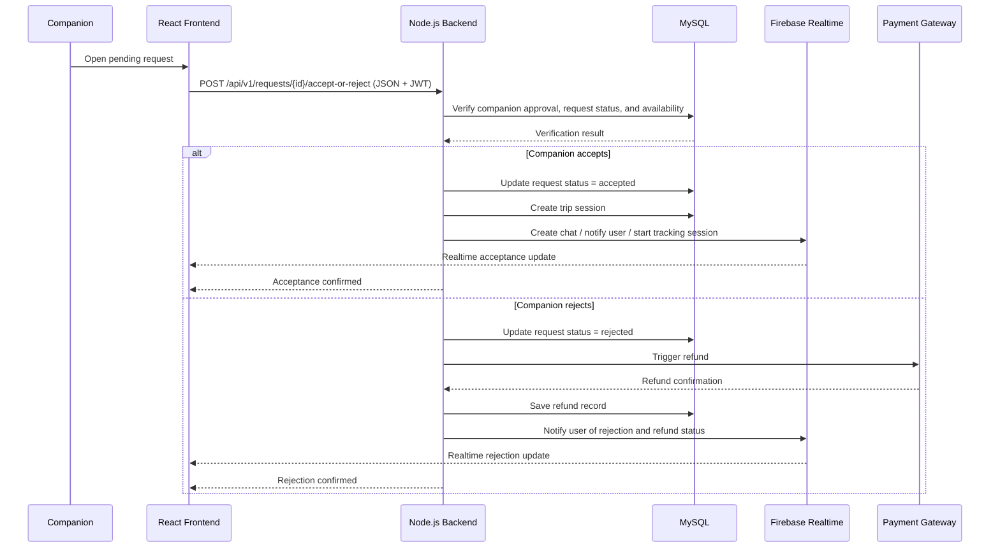
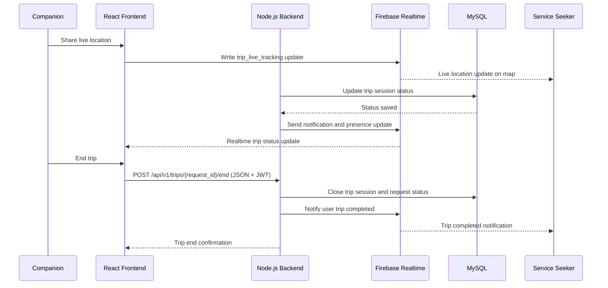
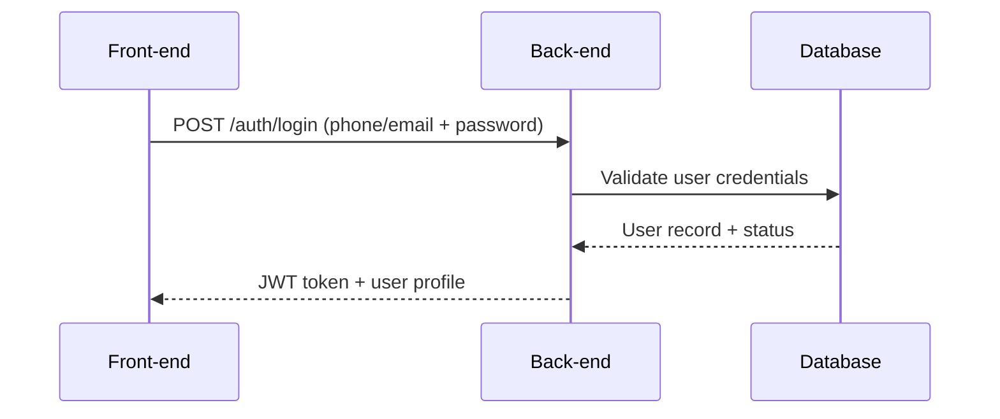
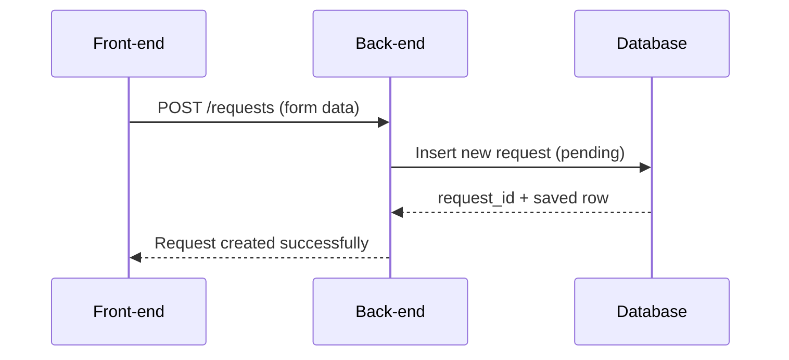
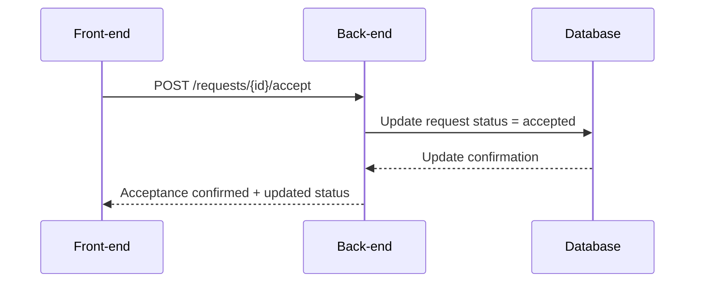

# High-Level Sequence Diagrams

## Use Case 1: Create Service Request and Pay Before Submission

## Use Case 2: Companion Accepts or Rejects the Request

## Use Case 3: Real-Time Trip Tracking and Trip Completion

---

## sequence diagrams showing interactions between components

### 1) User Login

### 2) Create Service Request

### 3) Companion Accept Request

