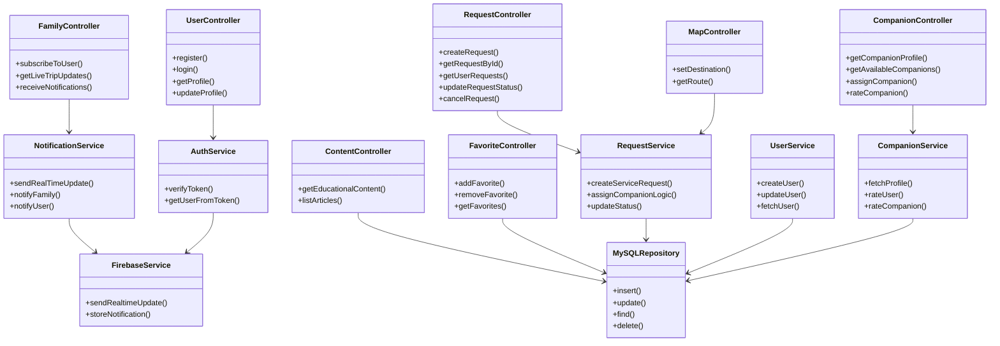

```mermaid
classDiagram

class UserController {
  +register()
  +login()
  +getProfile()
  +updateProfile()
}

class RequestController {
  +createRequest()
  +getRequestById()
  +getUserRequests()
  +updateRequestStatus()
  +cancelRequest()
}

class CompanionController {
  +getCompanionProfile()
  +getAvailableCompanions()
  +assignCompanion()
  +rateCompanion()
}

class FamilyController {
  +subscribeToUser()
  +getLiveTripUpdates()
  +receiveNotifications()
}

class MapController {
  +setDestination()
  +getRoute()
}

class ContentController {
  +getEducationalContent()
  +listArticles()
}

class FavoriteController {
  +addFavorite()
  +removeFavorite()
  +getFavorites()
}

class NotificationService {
  +sendRealTimeUpdate()
  +notifyFamily()
  +notifyUser()
}

class AuthService {
  +verifyToken()
  +getUserFromToken()
}

class RequestService {
  +createServiceRequest()
  +assignCompanionLogic()
  +updateStatus()
}

class CompanionService {
  +fetchProfile()
  +rateUser()
  +rateCompanion()
}

class UserService {
  +createUser()
  +updateUser()
  +fetchUser()
}

class MySQLRepository {
  +insert()
  +update()
  +find()
  +delete()
}

class FirebaseService {
  +sendRealtimeUpdate()
  +storeNotification()
}

UserController --> AuthService
RequestController --> RequestService
CompanionController --> CompanionService
FamilyController --> NotificationService
MapController --> RequestService
ContentController --> MySQLRepository
FavoriteController --> MySQLRepository

RequestService --> MySQLRepository
UserService --> MySQLRepository
CompanionService --> MySQLRepository

NotificationService --> FirebaseService
AuthService --> FirebaseService
```
