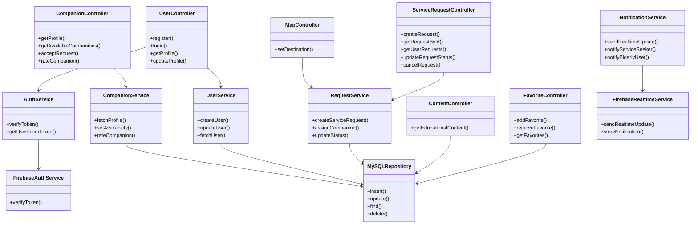

###

### Back-end Components (Classes) :
## User:
# Attributes:
- id: int
- name: String
- Email: String
- MobileNumber: int
- Birthdate: Date
- City: String
- District: String
- Languages: List<String>
- Rating
- role (Provider, Seeker)

## Provider:
# Attributes:
- User.id: int (FK)
- Services: List<String>
- OfferDays: List<DAY>
- OfferTime: List<Time>
- Experinces: Boolean
- Bio: String
- HaveCar: Boolean
- Car: String
- Storage: Links >>>>>>>>>>>>>>>>> ?? الملفات تنرفع وهنا ينحط رابط لها كيف تنكتب ؟
- Picture: نفس الشي
- Certifications: same
- IBAN: int
- Health: Boolean

## Seeker:  >>>>>> ?????????? وش الخاص فيه ؟
# Attributes:
- User.id: int (FK)
- EmergencyNumber: int
- ExtraInformation: String

## Admin:
- id: int
- 
