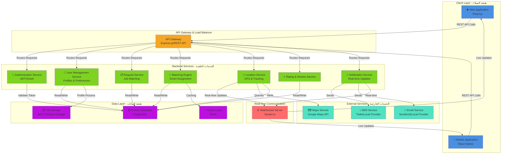

```mermaid
graph TB
    subgraph "Client Layer - طبقة العملاء"
        WEB["🌐 Web Application<br/>React.js"]
        MOBILE["📱 Mobile Application<br/>React Native"]
    end

    subgraph "API Gateway & Load Balancer"
        GATEWAY["API Gateway<br/>Express.js/REST API"]
    end

    subgraph "Backend Services - الخدمات الخلفية"
        AUTH["🔐 Authentication Service<br/>JWT/OAuth"]
        USER["👤 User Management Service<br/>Profiles & Preferences"]
        REQUEST["📋 Request Service<br/>Job Matching"]
        MATCH["🎯 Matching Engine<br/>Smart Assignment"]
        LOCATION["📍 Location Service<br/>GPS & Tracking"]
        RATING["⭐ Rating & Review Service"]
        NOTIFICATION["🔔 Notification Service<br/>Real-time Updates"]
    end

    subgraph "Data Layer - طبقة البيانات"
        DB["🗄️ Primary Database<br/>PostgreSQL"]
        CACHE["⚡ Cache Layer<br/>Redis"]
        STORAGE["📦 File Storage<br/>AWS S3/Cloud Storage"]
    end

    subgraph "External Services - الخدمات الخارجية"
        MAPS["🗺️ Maps Service<br/>Google Maps API"]
        SMS["📞 SMS Service<br/>Twilio/Local Provider"]
        EMAIL["📧 Email Service<br/>SendGrid/Local Provider"]
    end

    subgraph "Real-time Communication"
        WEBSOCKET["⚙️ WebSocket Server<br/>Socket.io"]
    end

    WEB -->|REST API Calls| GATEWAY
    MOBILE -->|REST API Calls| GATEWAY

    GATEWAY -->|Routes Requests| AUTH
    GATEWAY -->|Routes Requests| USER
    GATEWAY -->|Routes Requests| REQUEST
    GATEWAY -->|Routes Requests| MATCH
    GATEWAY -->|Routes Requests| LOCATION
    GATEWAY -->|Routes Requests| RATING
    GATEWAY -->|Routes Requests| NOTIFICATION

    AUTH -->|Validate Token| DB
    USER -->|Read/Write| DB
    USER -->|Profile Pictures| STORAGE
    REQUEST -->|Read/Write| DB
    MATCH -->|Read/Write| DB
    MATCH -->|Caching| CACHE
    LOCATION -->|Real-time Updates| WEBSOCKET
    LOCATION -->|Queries| MAPS
    LOCATION -->|Write| DB
    RATING -->|Read/Write| DB
    NOTIFICATION -->|Sends| SMS
    NOTIFICATION -->|Sends| EMAIL
    NOTIFICATION -->|Real-time| WEBSOCKET

    WEBSOCKET -->|Live Updates| WEB
    WEBSOCKET -->|Live Updates| MOBILE

    style WEB fill:#4A90E2
    style MOBILE fill:#4A90E2
    style GATEWAY fill:#F5A623
    style AUTH fill:#7ED321
    style USER fill:#7ED321
    style REQUEST fill:#7ED321
    style MATCH fill:#7ED321
    style LOCATION fill:#7ED321
    style RATING fill:#7ED321
    style NOTIFICATION fill:#7ED321
    style DB fill:#BD10E0
    style CACHE fill:#BD10E0
    style STORAGE fill:#BD10E0
    style MAPS fill:#50E3C2
    style SMS fill:#50E3C2
    style EMAIL fill:#50E3C2
    style WEBSOCKET fill:#FF6B6B
```
