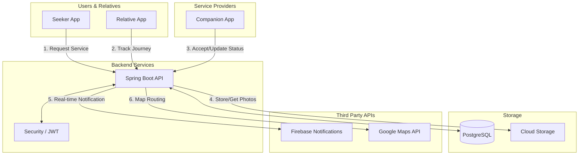

```mermaid
graph TD
    subgraph Client_Layer [Users & Relatives]
        Seeker[Seeker App]
        Relative[Relative App]
    end

    subgraph Companion_Layer [Service Providers]
        CompanionApp[Companion App]
    end

    subgraph Application_Layer [Backend Services]
        API[Spring Boot API]
        Auth[Security / JWT]
    end

    subgraph Data_Layer [Storage]
        DB[(PostgreSQL)]
        Storage[Cloud Storage]
    end

    subgraph External_Services [Third Party APIs]
        Notify[Firebase Notifications]
        Maps[Google Maps API]
    end

    Seeker -->|1. Request Service| API
    Relative -->|2. Track Journey| API
    CompanionApp -->|3. Accept/Update Status| API
    API <--> Auth
    API <--> DB
    API -->|4. Store/Get Photos| Storage
    API -->|5. Real-time Notification| Notify
    API -->|6. Map Routing| Maps
```
