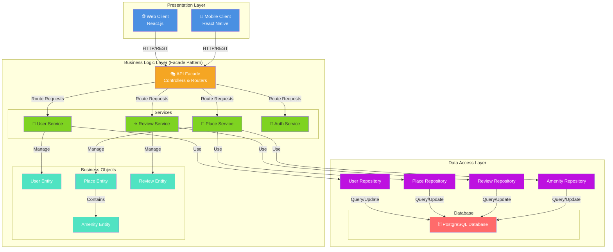
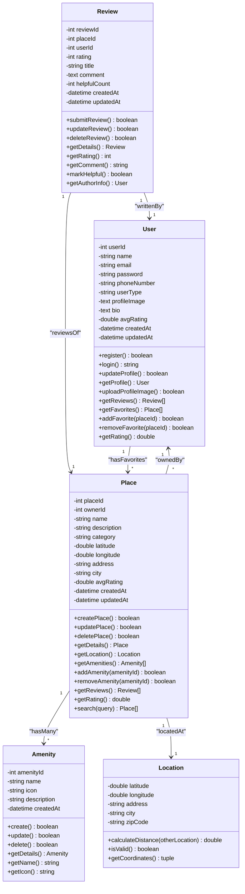
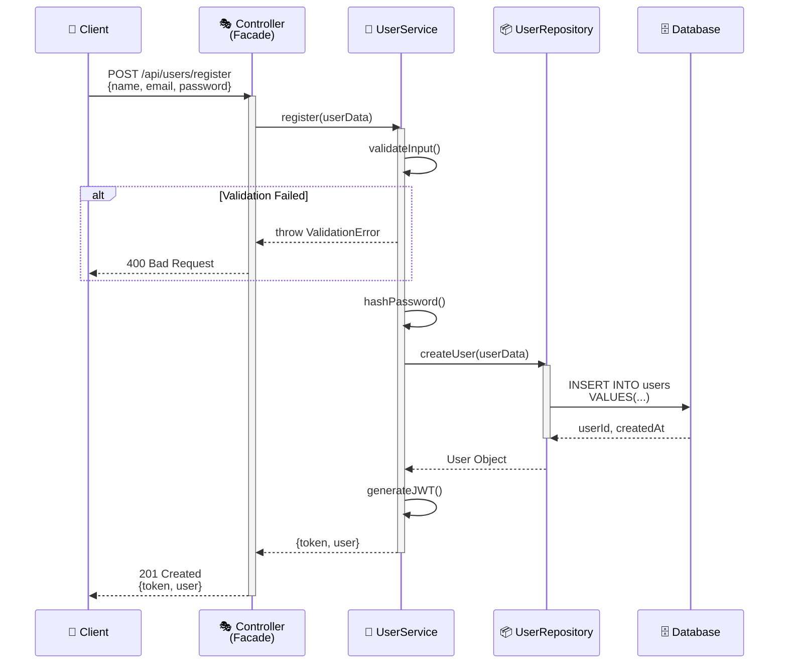
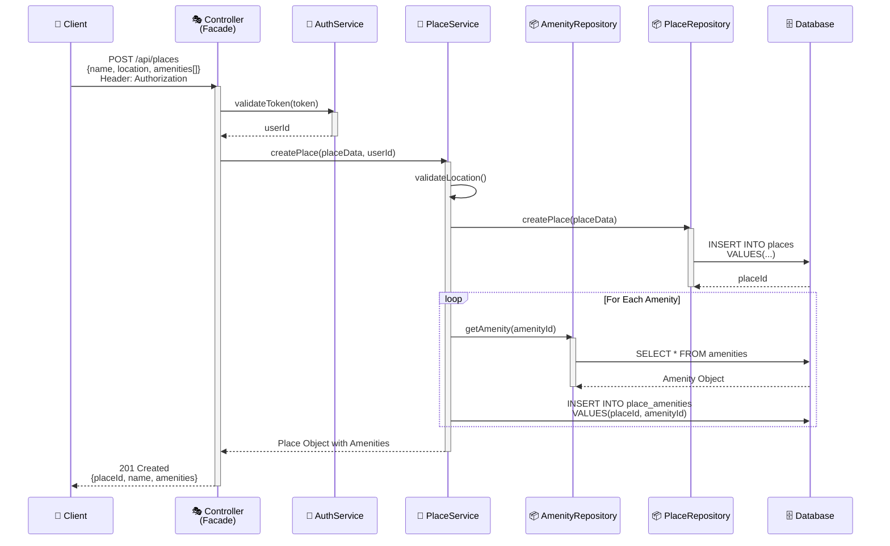
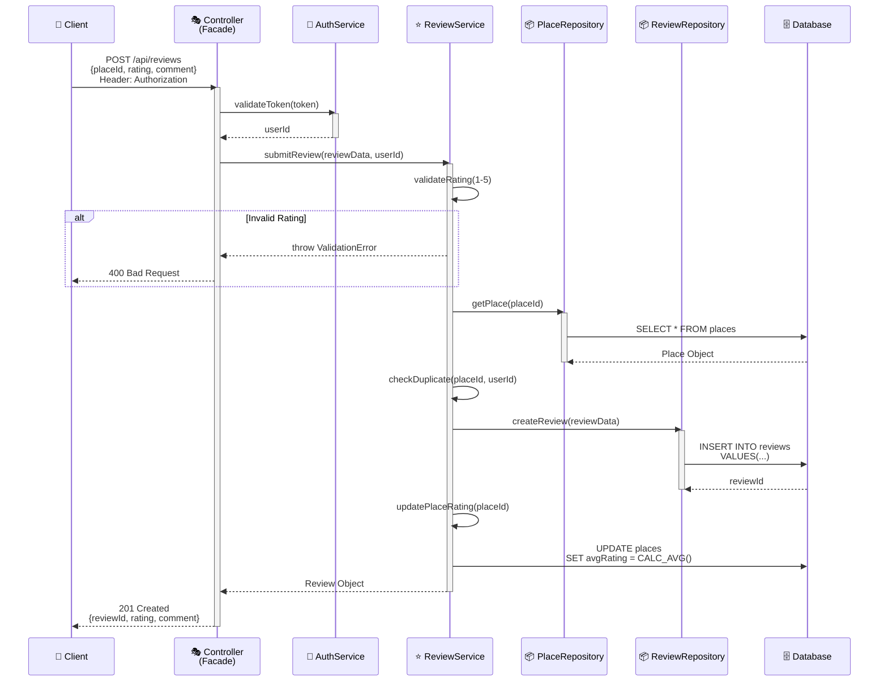
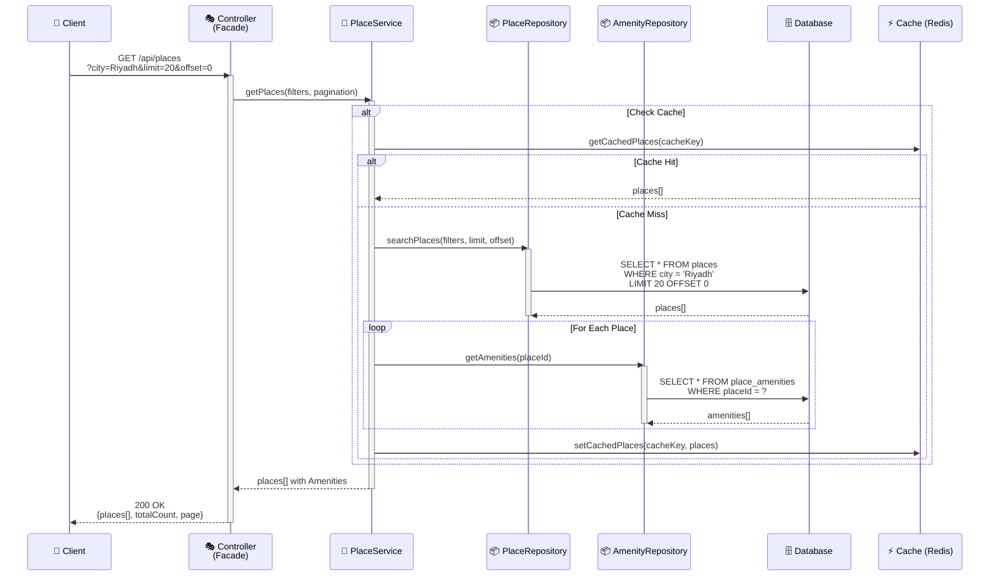

# System Architecture Diagram - المرافق (Al-Murafeq)

## 1️⃣ High-Level Package Diagram (Three-Layer Architecture)

---

## 2️⃣ Detailed Class Diagram for Business Logic Layer

---

## 3️⃣ Sequence Diagrams for API Calls

### 3.1 User Registration API Call

### 3.2 Create Place API Call

### 3.3 Submit Review API Call

### 3.4 Fetch Places List API Call

---

## 📋 Summary of Relationships

| Relationship | Type | Cardinality |
|-------------|------|-------------|
| User owns Place | One-to-Many | 1 User → * Places |
| Place has Amenity | Many-to-Many | * Places ↔ * Amenities |
| User writes Review | One-to-Many | 1 User → * Reviews |
| Place receives Review | One-to-Many | 1 Place → * Reviews |
| Place has Location | One-to-One | 1 Place → 1 Location |
| User has Favorites | Many-to-Many | * Users ↔ * Places |

---

## 🏗️ Architecture Layers Explanation

### **Presentation Layer**
- Handles user interface
- Communicates only with API Facade
- No direct database access

### **Business Logic Layer (Facade Pattern)**
- API Controllers act as a single entry point
- Services encapsulate business rules
- Business entities represent domain objects
- Repositories pattern for data access abstraction

### **Data Access Layer**
- Repositories handle all database queries
- Single responsibility: data persistence
- Decoupled from business logic

