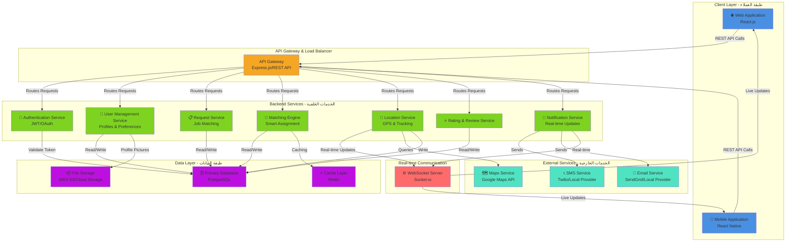

# System Architecture Diagram - المرافق (Al-Murafeq)

## High-Level System Architecture

## Data Flow Description - تدفق البيانات

### 1. **User Registration & Authentication** (تسجيل المستخدم)
- المستخدم ينشئ حساب (مسن أو مرافق أو ابن/ابنة)
- البيانات تُخزن في قاعدة البيانات
- صورة شخصية تُرفع إلى Cloud Storage

### 2. **Service Request Flow** (تقديم طلب الخدمة)
- مستخدم يضع طلب مساعدة
- تحديد نوع المساعدة والموقع
- Request Service يسجل الطلب في قاعدة البيانات

### 3. **Matching Engine** (مطابقة المرافق المناسب)
- Matching Engine تحلل الطلب
- تبحث عن مرافقين متاحين
- تراعي التقييمات والتفضيلات المحفوظة
- تختار أنسب مرافق

### 4. **Real-time Location Tracking** (تتبع الموقع لحظياً)
- Location Service يتلقى إحداثيات GPS من المرافق
- تُرسل التحديثات عبر WebSocket
- المستخدم يرى الموقع على الخريطة فوراً

### 5. **Notifications** (إشعارات فورية)
- Notification Service ترسل SMS/Email
- تتضمن بيانات التواصل مع المرافق
- تحديثات الحالة لحظياً عبر WebSocket

### 6. **Rating & Review** (تقييم الخدمة)
- بعد انتهاء الخدمة
- المستخدم يقيّم الطرف الآخر
- التقييمات تُحسّن نظام المطابقة

## Key Features Mapping - خريطة الميزات

| Feature | المسار المعماري |
|---------|-----------------|
| **تحديد نوع المساعدة** | REQUEST → DB |
| **استلام بيانات المرافق** | NOTIFICATION → SMS/EMAIL |
| **تحديثات لحظية للحالة** | LOCATION → WEBSOCKET → MOBILE/WEB |
| **صورة المرافق** | STORAGE → USER SERVICE → MOBILE/WEB |
| **حفظ المفضلين** | USER → DB → MATCH |
| **تحديد الموقع على الخريطة** | LOCATION → MAPS API |
| **سجل الطلبات** | REQUEST → DB |
| **التقييمات** | RATING → DB |

## Technology Stack - المكدس التكنولوجي

**Frontend:**
- React.js / React Native
- Leaflet/Mapbox for Maps

**Backend:**
- Node.js + Express.js
- Socket.io for Real-time Communication

**Database:**
- PostgreSQL (Primary)
- Redis (Caching & Real-time data)

**External APIs:**
- Google Maps API
- Twilio/Local SMS Provider
- SendGrid/Local Email Provider

**Cloud Services:**
- AWS S3 or Similar for Image Storage
- Load Balancing & Hosting

