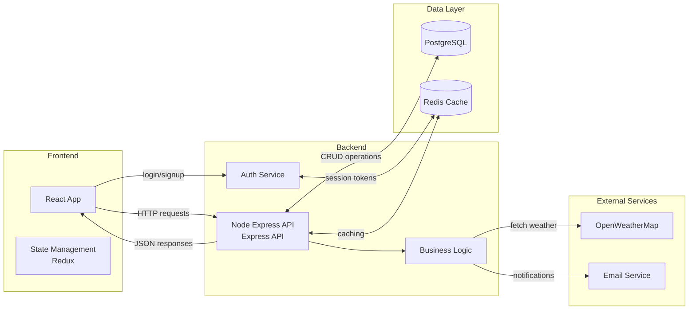

# System Architecture Diagram - المرافق (Al-Murafeq)

## 1️⃣ High-Level Package Diagram (Three-Layer Architecture)

# MVP System Architecture

```mermaid
flowchart LR

  subgraph Frontend
    RA[React App]
    SM[State Management<br/>Redux]
  end

  subgraph Backend
    API[Node Express API<br/>Express API]
    AUTH[Auth Service]
    BL[Business Logic]
  end

  subgraph Data_Layer[Data Layer]
    PG[(PostgreSQL)]
    REDIS[(Redis Cache)]
  end

  subgraph External_Services[External Services]
    OWM[OpenWeatherMap]
    EMAIL[Email Service]
  end

  %% Frontend to Backend
  RA -->|HTTP requests| API
  API -->|JSON responses| RA
  RA -->|login/signup| AUTH

  %% Auth flow
  AUTH <-->|session tokens| REDIS

  %% Backend to Data
  API <-->|CRUD operations| PG
  API <-->|caching| REDIS

  %% Internal backend flow
  API --> BL

  %% External integrations
  BL -->|fetch weather| OWM
  BL -->|notifications| EMAIL
```
