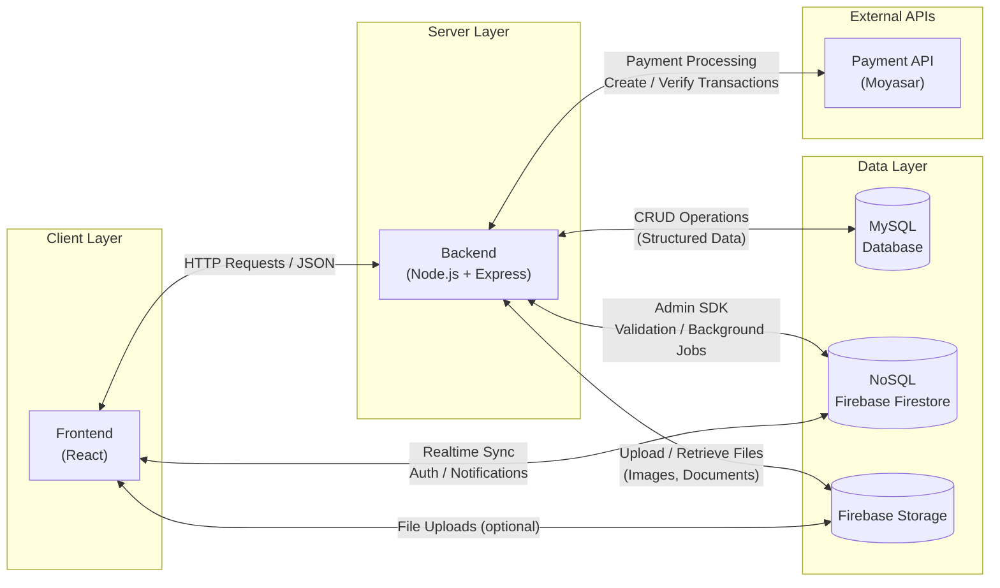
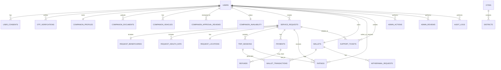
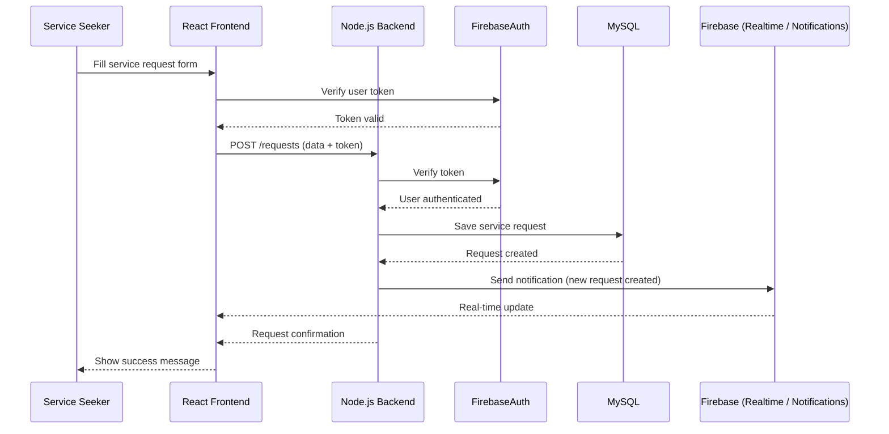
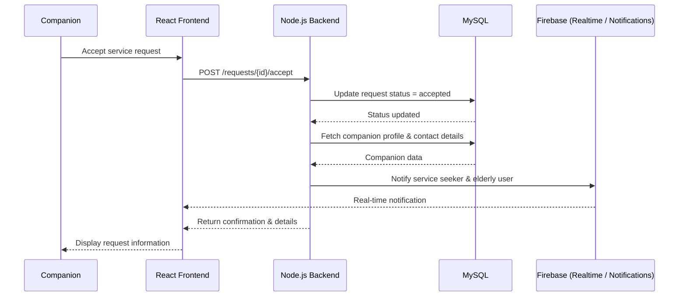
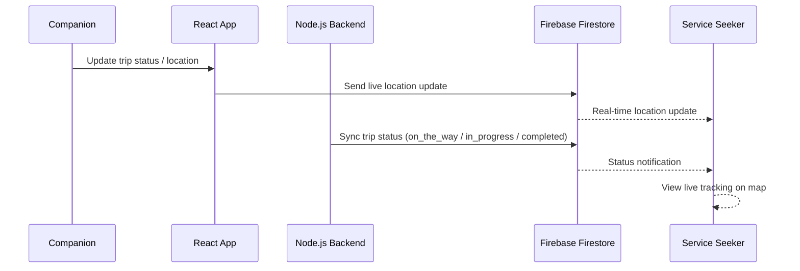

# Rafeeq Project - Technical Documentation

Rafeeq is an MVP care-coordination platform built with a role-based architecture (Elderly User, Service Seeker, Companion, Admin) and API-driven workflows for request creation, companion assignment, and real-time service status tracking. This technical documentation defines the system architecture, data models, interaction flows, API specifications, and SCM/QA practices for implementation and quality control.

---

## User Stories and Mockups

### 0.1 User Stories

#### Persona 1: Elderly User

##### Must Have (MVP)
- **As an elderly user**, I want to have a personal profile containing my basic information and needs, **so that** the companion can assist me appropriately.
- **As an elderly user**, I want to receive a companion assigned to me based on my assistance needs, **so that** I feel safe and supported.
- **As an elderly user**, I want to view the assigned companion’s profile (photo and name), **so that** I can recognize them when they arrive.
- **As an elderly user**, I want to know the status of my current service (requested, accepted, in progress, completed), **so that** I am aware of what is happening.

##### Should Have
- **As an elderly user**, I want to have special notes added to my profile (e.g., mobility or hearing issues), **so that** the companion is prepared in advance.
- **As an elderly user**, I want to view my previous services, **so that** I can remember and review past assistance.

##### Could Have
- **As an elderly user**, I want to rate the companion after the service ends, **so that** service quality improves.

#### Persona 2: Service Seeker (Requester on Behalf of Elderly)

##### Must Have (MVP)
- **As a service seeker**, I want to create and manage a service request on behalf of an elderly user, **so that** they receive the assistance they need.
- **As a service seeker**, I want to specify the type of assistance required (e.g., hospital visit, daily errand), **so that** a suitable companion is assigned.
- **As a service seeker**, I want to set the destination location on a map, **so that** the companion can reach it accurately.
- **As a service seeker**, I want to view the assigned companion’s profile and contact details, **so that** I can verify their identity and communicate if needed.
- **As a service seeker**, I want to receive real-time updates about the service status, **so that** I am reassured about the elderly person’s safety.

##### Should Have
- **As a service seeker**, I want to save preferred companions, **so that** I can request the same trusted companion again.
- **As a service seeker**, I want to view current and past service requests, **so that** I can track all activities.

##### Could Have
- **As a service seeker**, I want to access educational content related to elderly care, **so that** I can better support the elderly user.
- **As a service seeker**, I want to rate the overall service after completion, **so that** trust and quality are maintained.

#### Persona 3: Companion (Service Provider)

##### Must Have (MVP)
- **As a companion**, I want to create a profile with my personal details and a clear photo, **so that** users can identify and trust me.
- **As a companion**, I want to receive service requests that match my availability and skills, **so that** I can provide appropriate assistance.
- **As a companion**, I want to accept or reject service requests, **so that** I can manage my schedule.
- **As a companion**, I want to view the service details (elderly needs, destination, notes), **so that** I am fully prepared.
- **As a companion**, I want to update the service status (on the way, arrived, completed), **so that** the elderly user and service seeker are informed.

##### Should Have
- **As a companion**, I want to view my past services, **so that** I can track my work history.
- **As a companion**, I want to view ratings and feedback from users, **so that** I can improve my service.

##### Could Have
- **As a companion**, I want to set my availability schedule, **so that** I only receive requests during suitable times.

#### Persona 4: Admin (Operational Role)

##### Must Have (MVP)
- **As an admin**, I want to review and approve companion registrations, **so that** only verified companions operate on the platform.
- **As an admin**, I want to monitor active and completed services, **so that** platform operations run smoothly.
- **As an admin**, I want to manage reported issues or complaints, **so that** user safety is ensured.

#### Won’t Have (Out of MVP Scope)
- The platform will not provide transportation services.
- The platform will not offer specialized medical services.
- The platform will not support automated recurring bookings.
- The platform will not include advanced features like video calls or AI at this stage.

### 0.2 Mockups
- Figma mockups: https://www.figma.com/design/x9hMMW6QkC3SZNpvP9DhdO/Rafeeq?node-id=466-1050&t=qBgle9rrTheDQCe1-1

---

## Design System Architecture

# MVP System Architecture
## High-Level Package Diagram (Three-Layer Architecture)



## Architecture Overview

The system is designed as a full-stack web platform following a three-layer architecture that ensures scalability, maintainability, and clear separation of concerns.

The architecture consists of a client layer for user interaction, a server layer for business logic and system operations, and a data layer for data persistence and real-time services.

### System Components

| Component | Technology | Description |
|----------|------------|-------------|
| Frontend | React | Single Page Application (SPA) responsible for rendering the user interface and handling user interactions |
| Backend | Node.js (Express.js) | RESTful API server responsible for business logic, request validation, authentication, and integrations |
| Database (SQL) | MySQL | Relational database used for structured and transactional data |
| Database (NoSQL) | Firebase Firestore | NoSQL database used for real-time synchronization, notifications, and lightweight data |
| File Storage | Firebase Storage | Cloud-based storage for images, documents, and user-uploaded files |
| Authentication | Firebase Authentication | Secure token-based authentication and session management |
| Payment Gateway | Moyasar | Secure payment processing for Visa, MasterCard, and Mada |

### Architectural Principles

- **Separation of Concerns:** Each layer is responsible for a specific set of tasks, reducing coupling between components.
- **Scalability:** The backend and data layers can scale independently based on system load.
- **Security:** Authentication is handled using Firebase Authentication with token verification on the backend.
- **Extensibility:** The architecture allows for easy integration of additional services and features in future phases.

---

## Define Components, Classes, and Database Design

### 2.1 UI Components and Interactions

- **Public Home Page**: navigates to service requests, bulletins, motion graphics, and companion account creation.
- **Authentication Screens**: handle sign up, login, OTP verification, and password reset.
- **Service Request Wizard**: collects request data and moves the user through the request steps.
- **Companion Selection Screen**: displays companions and lets the user choose one.
- **Payment Screen**: processes the full trip payment before sending the request.
- **Trip Tracking Screen**: shows the live map, companion car details if available, and chat access.
- **Chat Screen**: enables real-time messaging between the user and the companion.
- **Companion Dashboard**: shows ratings, upcoming tasks, nearby requests, earnings, and online/offline status.
- **Companion Profile & Documents Screen**: lets the companion complete profile data and upload documents for admin approval.
- **Wallet Screen**: shows earnings, withdrawable balance, monthly income, and bank transfer request.
- **Ratings Screen**: lets the user rate the companion after the trip.
- **Support Screen**: lets the user send complaints, suggestions, or inquiries.
- **Admin Review Screens**: let the admin review companion profiles, documents, approvals, and actions.

### 2.2 Backend Classes (Attributes & Methods)

#### User
Represents any account type in the system: user, companion, or admin.
- **Attributes**: `id`, `first_name`, `last_name`, `mobile`, `email`, `password_hash`, `account_type`, `account_status`, `last_login_at`, `created_at`, `updated_at`
- **Methods**: `updateProfile()`, `changePassword()`, `activate()`, `suspend()`, `recordLogin()`

#### UserConsent
Stores the user’s accepted legal agreements.
- **Attributes**: `id`, `user_id`, `consent_type`, `consent_version`, `accepted_at`, `created_at`
- **Methods**: `acceptConsent()`, `validateConsentVersion()`, `hasAccepted()`

#### OTPVerification
Stores OTP verification attempts and results.
- **Attributes**: `id`, `user_id`, `channel`, `otp_code_hash`, `expires_at`, `verified_at`, `attempts_count`, `status`, `created_at`
- **Methods**: `generateCode()`, `verifyCode()`, `expireCode()`, `incrementAttempts()`

#### CompanionProfile
Stores the companion’s profile details and public health status.
- **Attributes**: `id`, `user_id`, `gender`, `nationality`, `date_of_birth`, `city`, `district`, `short_description`, `experience_summary`, `health_status`, `has_car`, `created_at`, `updated_at`
- **Methods**: `completeProfile()`, `updateProfile()`, `setHealthStatus()`, `setCarFlag()`

#### CompanionDocument
Stores documents uploaded by the companion for approval.
- **Attributes**: `id`, `user_id`, `document_type`, `file_url`, `status`, `review_note`, `reviewed_by_admin_id`, `reviewed_at`, `created_at`
- **Methods**: `uploadDocument()`, `approveDocument()`, `rejectDocument()`, `addReviewNote()`

#### CompanionVehicle
Stores car details when the companion chooses to work with a car.
- **Attributes**: `id`, `user_id`, `car_type`, `car_model`, `plate_number`, `created_at`, `updated_at`
- **Methods**: `addVehicle()`, `updateVehicle()`, `removeVehicle()`

#### CompanionApprovalReview
Stores the admin approval workflow for companion activation.
- **Attributes**: `id`, `user_id`, `profile_completed`, `documents_completed`, `approval_status`, `rejection_reason`, `approved_by_admin_id`, `approved_at`, `created_at`, `updated_at`
- **Methods**: `reviewProfile()`, `approve()`, `reject()`, `recordRejectionReason()`

#### CompanionAvailability
Tracks whether the companion is online and willing to receive work.
- **Attributes**: `id`, `user_id`, `connection_status`, `work_status`, `updated_at`
- **Methods**: `setOnline()`, `setOffline()`, `setAvailable()`, `setUnavailable()`

#### ServiceRequest
Represents the main service request created by the user.
- **Attributes**: `id`, `user_id`, `request_for`, `service_type`, `request_mode`, `with_car`, `status`, `scheduled_at`, `created_at`, `updated_at`
- **Methods**: `createRequest()`, `attachBeneficiary()`, `attachHealthData()`, `setLocation()`, `assignCompanion()`, `changeStatus()`, `cancelRequest()`, `scheduleRequest()`

#### RequestBeneficiary
Stores beneficiary details when the request is made for someone else.
- **Attributes**: `id`, `request_id`, `full_name`, `age`, `mobile`, `gender`, `relationship`, `created_at`
- **Methods**: `saveBeneficiary()`, `updateBeneficiary()`

#### RequestHealthData
Stores health-related data attached to a request.
- **Attributes**: `id`, `request_id`, `health_condition`, `other_text`, `created_at`
- **Methods**: `addCondition()`, `updateCondition()`, `removeCondition()`

#### RequestLocation
Stores pickup and destination information for a request.
- **Attributes**: `id`, `request_id`, `pickup_city`, `pickup_district`, `pickup_street`, `pickup_building_number`, `pickup_apartment_number`, `pickup_short_address`, `pickup_lat`, `pickup_lng`, `destination_city`, `destination_district`, `destination_street`, `destination_building_number`, `destination_apartment_number`, `destination_short_address`, `destination_lat`, `destination_lng`, `created_at`
- **Methods**: `setPickupLocation()`, `setDestinationLocation()`, `updateCoordinates()`

#### TripSession
Represents a real trip session within a request, especially when the companion changes.
- **Attributes**: `id`, `request_id`, `companion_id`, `status`, `started_at`, `ended_at`, `created_at`
- **Methods**: `startTrip()`, `endTrip()`, `extendTrip()`, `transferToAnotherCompanion()`

#### Payment
Stores payment records for a request.
- **Attributes**: `id`, `request_id`, `user_id`, `amount`, `status`, `provider_transaction_id`, `paid_at`, `created_at`
- **Methods**: `initiatePayment()`, `confirmPayment()`, `refundPayment()`, `handleWebhook()`

#### Refund
Stores payment refunds.
- **Attributes**: `id`, `payment_id`, `amount`, `status`, `reason`, `refunded_at`, `created_at`
- **Methods**: `requestRefund()`, `completeRefund()`, `failRefund()`

#### Wallet
Represents the companion wallet.
- **Attributes**: `id`, `companion_id`, `available_balance`, `monthly_earnings`, `status`, `created_at`, `updated_at`
- **Methods**: `addEarning()`, `requestWithdrawal()`, `approveWithdrawal()`, `deductAmount()`

#### WalletTransaction
Stores all wallet movements.
- **Attributes**: `id`, `wallet_id`, `trip_session_id`, `transaction_type`, `amount`, `net_profit`, `status`, `created_at`
- **Methods**: `recordEarning()`, `recordWithdrawal()`, `recordAdjustment()`

#### WithdrawalRequest
Stores companion withdrawal requests.
- **Attributes**: `id`, `wallet_id`, `amount`, `bank_name`, `iban`, `status`, `reviewed_by_admin_id`, `reviewed_at`, `created_at`
- **Methods**: `submitWithdrawal()`, `approveWithdrawal()`, `rejectWithdrawal()`, `transferFunds()`

#### Rating
Stores user ratings and comments after a trip.
- **Attributes**: `id`, `request_id`, `trip_session_id`, `user_id`, `companion_id`, `stars`, `comment`, `created_at`
- **Methods**: `submitRating()`, `updateRating()`, `deleteRating()`

#### SupportTicket
Stores complaints, suggestions, and support requests.
- **Attributes**: `id`, `user_id`, `request_id`, `ticket_type`, `subject`, `message`, `status`, `created_at`, `updated_at`
- **Methods**: `createTicket()`, `addMessage()`, `changeStatus()`, `closeTicket()`

#### AdminAction
Stores administrative actions on users, companions, withdrawals, documents, and requests.
- **Attributes**: `id`, `admin_user_id`, `target_type`, `target_id`, `action_type`, `notes`, `created_at`
- **Methods**: `logAction()`, `addNotes()`, `linkTarget()`

#### AdminReview
Stores companion review records handled by the admin.
- **Attributes**: `id`, `companion_id`, `review_status`, `reviewed_by_admin_id`, `review_note`, `reviewed_at`, `created_at`
- **Methods**: `approveCompanion()`, `rejectCompanion()`, `recordReview()`

#### AuditLog
Stores critical system audit records.
- **Attributes**: `id`, `actor_user_id`, `action`, `entity_type`, `entity_id`, `metadata`, `created_at`
- **Methods**: `recordEvent()`, `appendMetadata()`, `traceAction()`

#### Chat
Represents a real-time chat thread in Firebase.
- **Attributes**: `id`, `request_id`, `user_id`, `companion_id`, `status`, `last_message`, `last_message_at`, `last_message_sender_id`, `user_unread_count`, `companion_unread_count`, `created_at`, `updated_at`
- **Methods**: `createChat()`, `closeChat()`, `markAsRead()`, `updateLastMessage()`

#### ChatMessage
Represents a single message in a Firebase chat thread.
- **Attributes**: `id`, `chat_id`, `sender_id`, `message_type`, `message_text`, `attachment_url`, `is_read`, `read_at`, `created_at`
- **Methods**: `sendMessage()`, `markAsRead()`, `attachFile()`

#### LiveTracking
Represents the companion’s live location updates during an active trip.
- **Attributes**: `id`, `request_id`, `trip_session_id`, `companion_id`, `latitude`, `longitude`, `speed`, `heading`, `updated_at`
- **Methods**: `publishLocation()`, `stopTracking()`, `updateRoute()`

#### Presence
Tracks whether a user is online or offline in real time.
- **Attributes**: `user_id`, `status`, `last_seen_at`, `updated_at`
- **Methods**: `setOnline()`, `setOffline()`, `updateLastSeen()`

#### Notification
Stores real-time notifications.
- **Attributes**: `id`, `user_id`, `title`, `body`, `notification_type`, `related_type`, `related_id`, `is_read`, `read_at`, `created_at`
- **Methods**: `pushNotification()`, `markAsRead()`, `archiveNotification()`

#### SupportChat
Represents a real-time support conversation.
- **Attributes**: `id`, `ticket_id`, `sender_id`, `message_text`, `attachment_url`, `is_read`, `created_at`
- **Methods**: `sendSupportMessage()`, `markAsRead()`, `attachSupportFile()`

### 2.3 MySQL Schema

#### Tables and Attributes

##### users
- id (PK)
- first_name
- last_name
- mobile (UNIQUE)
- email (UNIQUE)
- password_hash
- account_type (user / companion / admin)
- account_status (inactive / active / suspended / pending_verification)
- last_login_at
- created_at
- updated_at

##### user_consents
- id (PK)
- user_id (FK -> users.id)
- consent_type (terms / privacy)
- consent_version
- accepted_at
- created_at

##### otp_verifications
- id (PK)
- user_id (FK -> users.id)
- channel (mobile / email)
- otp_code_hash
- expires_at
- verified_at
- attempts_count
- status (pending / verified / expired / failed)
- created_at

##### companion_profiles
- id (PK)
- user_id (FK -> users.id, UNIQUE)
- gender
- nationality
- date_of_birth
- city
- district
- short_description
- experience_summary
- health_status
- has_car
- created_at
- updated_at

##### companion_documents
- id (PK)
- user_id (FK -> users.id)
- document_type
- file_url
- status
- review_note
- reviewed_by_admin_id (FK -> users.id)
- reviewed_at
- created_at

##### companion_vehicles
- id (PK)
- user_id (FK -> users.id)
- car_type
- car_model
- plate_number
- created_at
- updated_at

##### companion_approval_reviews
- id (PK)
- user_id (FK -> users.id)
- profile_completed
- documents_completed
- approval_status (pending / approved / rejected)
- rejection_reason
- approved_by_admin_id (FK -> users.id)
- approved_at
- created_at
- updated_at

##### companion_availability
- id (PK)
- user_id (FK -> users.id, UNIQUE)
- connection_status (online / offline)
- work_status (available / unavailable)
- updated_at

##### service_requests
- id (PK)
- user_id (FK -> users.id)
- request_for (self / other)
- service_type
- request_mode (instant / scheduled)
- with_car
- status
- scheduled_at
- created_at
- updated_at

##### request_beneficiaries
- id (PK)
- request_id (FK -> service_requests.id)
- full_name
- age
- mobile
- gender
- relationship
- created_at

##### request_health_data
- id (PK)
- request_id (FK -> service_requests.id)
- health_condition
- other_text
- created_at

##### request_locations
- id (PK)
- request_id (FK -> service_requests.id)
- pickup_city
- pickup_district
- pickup_street
- pickup_building_number
- pickup_apartment_number
- pickup_short_address
- pickup_lat
- pickup_lng
- destination_city
- destination_district
- destination_street
- destination_building_number
- destination_apartment_number
- destination_short_address
- destination_lat
- destination_lng
- created_at

##### trip_sessions
- id (PK)
- request_id (FK -> service_requests.id)
- companion_id (FK -> users.id)
- status
- started_at
- ended_at
- created_at

##### payments
- id (PK)
- request_id (FK -> service_requests.id)
- user_id (FK -> users.id)
- amount
- status (pending / paid / failed / refunded)
- provider_transaction_id
- paid_at
- created_at

##### refunds
- id (PK)
- payment_id (FK -> payments.id)
- amount
- status (pending / completed / failed)
- reason
- refunded_at
- created_at

##### wallets
- id (PK)
- companion_id (FK -> users.id, UNIQUE)
- available_balance
- monthly_earnings
- status
- created_at
- updated_at

##### wallet_transactions
- id (PK)
- wallet_id (FK -> wallets.id)
- trip_session_id (FK -> trip_sessions.id)
- transaction_type (earning / withdrawal / adjustment)
- amount
- net_profit
- status (pending / completed)
- created_at

##### withdrawal_requests
- id (PK)
- wallet_id (FK -> wallets.id)
- amount
- bank_name
- iban
- status (pending_admin / approved / rejected / transferred)
- reviewed_by_admin_id (FK -> users.id)
- reviewed_at
- created_at

##### ratings
- id (PK)
- request_id (FK -> service_requests.id)
- trip_session_id (FK -> trip_sessions.id)
- user_id (FK -> users.id)
- companion_id (FK -> users.id)
- stars
- comment
- created_at

##### support_tickets
- id (PK)
- user_id (FK -> users.id)
- request_id (FK -> service_requests.id, NULLABLE)
- ticket_type (complaint / suggestion / inquiry)
- subject
- message
- status (open / in_progress / closed)
- created_at
- updated_at

##### admin_actions
- id (PK)
- admin_user_id (FK -> users.id)
- target_type (user / companion / withdrawal / document / request)
- target_id
- action_type (approve / reject / suspend / activate / refund / review)
- notes
- created_at

##### admin_reviews
- id (PK)
- companion_id (FK -> users.id)
- review_status (pending / approved / rejected)
- reviewed_by_admin_id (FK -> users.id)
- review_note
- reviewed_at
- created_at

##### audit_logs
- id (PK)
- actor_user_id (FK -> users.id)
- action
- entity_type
- entity_id
- metadata
- created_at

##### service_types
- id (PK)
- name
- is_active
- created_at

##### health_conditions
- id (PK)
- name
- is_active
- created_at

##### cities
- id (PK)
- name
- is_active

##### districts
- id (PK)
- city_id (FK -> cities.id)
- name
- is_active

#### Relationships

- users 1 -> N user_consents
- users 1 -> N otp_verifications
- users 1 -> 1 companion_profiles
- users 1 -> N companion_documents
- users 1 -> N companion_vehicles
- users 1 -> N companion_approval_reviews
- users 1 -> 1 companion_availability
- users 1 -> N service_requests
- service_requests 1 -> 0..1 request_beneficiaries
- service_requests 1 -> N request_health_data
- service_requests 1 -> 1 request_locations
- service_requests 1 -> N trip_sessions
- service_requests 1 -> N payments
- payments 1 -> N refunds
- users (companion) 1 -> 1 wallets
- wallets 1 -> N wallet_transactions
- wallets 1 -> N withdrawal_requests
- trip_sessions 1 -> N wallet_transactions
- service_requests 1 -> N ratings
- trip_sessions 1 -> N ratings
- users 1 -> N ratings
- users 1 -> N support_tickets
- service_requests 1 -> N support_tickets (optional)
- users (admin) 1 -> N admin_actions
- users (admin) 1 -> N admin_reviews
- users 1 -> N audit_logs
- cities 1 -> N districts

#### ER Diagram



### 2.4 Firebase / Firestore Schema

#### Collection: chats
Document:
```json
{
	"id": "chat_1",
	"request_id": "request_1",
	"user_id": "user_1",
	"companion_id": "companion_1",
	"status": "active",
	"created_at": "2026-04-25T10:00:00Z",
	"updated_at": "2026-04-25T10:00:00Z",
	"last_message": "Hello",
	"last_message_at": "2026-04-25T10:05:00Z",
	"last_message_sender_id": "user_1",
	"user_unread_count": 1,
	"companion_unread_count": 0
}
```
Mandatory fields: `request_id`, `user_id`, `companion_id`, `status`, `created_at`, `updated_at`
Optional fields: `last_message`, `last_message_at`, `last_message_sender_id`, `user_unread_count`, `companion_unread_count`

#### Collection: chat_messages
Document:
```json
{
	"id": "message_1",
	"chat_id": "chat_1",
	"sender_id": "user_1",
	"message_type": "text",
	"created_at": "2026-04-25T10:05:00Z",
	"message_text": "I am here",
	"attachment_url": null,
	"is_read": false,
	"read_at": null
}
```
Mandatory fields: `chat_id`, `sender_id`, `message_type`, `created_at`
Optional fields: `message_text`, `attachment_url`, `is_read`, `read_at`

#### Collection: trip_live_tracking
Document:
```json
{
	"id": "track_1",
	"request_id": "request_1",
	"trip_session_id": "trip_1",
	"companion_id": "companion_1",
	"latitude": 24.7136,
	"longitude": 46.6753,
	"updated_at": "2026-04-25T10:10:00Z",
	"speed": 45,
	"heading": 180
}
```
Mandatory fields: `request_id`, `trip_session_id`, `companion_id`, `latitude`, `longitude`, `updated_at`
Optional fields: `speed`, `heading`

#### Collection: presence
Document:
```json
{
	"user_id": "companion_1",
	"status": "online",
	"updated_at": "2026-04-25T10:10:00Z",
	"last_seen_at": null
}
```
Mandatory fields: `status`, `updated_at`
Optional fields: `last_seen_at`

#### Collection: notifications
Document:
```json
{
	"id": "notif_1",
	"user_id": "user_1",
	"title": "Trip Update",
	"body": "Your companion has arrived.",
	"notification_type": "trip_update",
	"is_read": false,
	"created_at": "2026-04-25T10:15:00Z",
	"related_type": "request",
	"related_id": "request_1",
	"read_at": null
}
```
Mandatory fields: `user_id`, `title`, `body`, `notification_type`, `is_read`, `created_at`
Optional fields: `related_type`, `related_id`, `read_at`

#### Collection: support_chat
Document:
```json
{
	"id": "support_1",
	"ticket_id": "ticket_1",
	"sender_id": "user_1",
	"message_text": "I have a complaint.",
	"created_at": "2026-04-25T10:20:00Z",
	"attachment_url": null,
	"is_read": false
}
```
Mandatory fields: `ticket_id`, `sender_id`, `message_text`, `created_at`
Optional fields: `attachment_url`, `is_read`

---

## High-Level Sequence Diagrams

## Use Case: Create Service Request (Service Seeker Requests Assistance)



## Use Case: Accept Request & Share Companion Details



## Use Case: Real-Time Trip Tracking (Family Monitoring)



---

## External and Internal APIs

## External APIs

### 1) Moyasar Payments API
**Why it was chosen:** It supports payment charging, refunds, and webhook confirmations, which matches the project’s requirement to collect the full trip payment before sending the request to the companion.

**Main usage:**
- Create payment charges
- Confirm payment status
- Handle refund flows
- Receive webhook events

### 2) Firebase Firestore / Realtime API
**Why it was chosen:** It supports real-time chat, live tracking, presence updates, notifications, and support chat, which are all time-sensitive parts of the platform.

**Main usage:**
- Store chat threads and messages
- Store live tracking updates
- Store online/offline presence
- Push notifications
- Store support chat messages

### 3) Firebase Storage API
**Why it was chosen:** It is suitable for storing companion documents, profile images, car documents, and chat attachments in a secure file storage layer.

**Main usage:**
- Upload companion documents
- Upload profile images
- Upload car-related documents
- Upload message attachments

### 4) Google Maps Platform API
**Why it was chosen:** The project needs map display, location selection, and live trip tracking, so a maps provider is required for geocoding and map visualization.

**Main usage:**
- Display pickup and destination maps
- Convert addresses to coordinates
- Show companion location on the map
- Support routing and location lookup

---

## Internal APIs

### 1) Auth APIs

#### POST /api/v1/auth/register
- **Input format:** JSON
- **Input:** `first_name`, `last_name`, `mobile`, `email`, `password`, `confirm_password`, `consent_type`
- **Output format:** JSON
- **Output:** account creation status, user data, verification state

#### POST /api/v1/auth/login
- **Input format:** JSON
- **Input:** `mobile` or `email`, `password`
- **Output format:** JSON
- **Output:** token, user data, account status

#### POST /api/v1/auth/verify-otp
- **Input format:** JSON
- **Input:** `user_id`, `channel`, `otp_code`
- **Output format:** JSON
- **Output:** verification result

### 2) User APIs

#### GET /api/v1/users/me
- **Input format:** None
- **Output format:** JSON
- **Output:** current user profile

#### PUT /api/v1/users/me
- **Input format:** JSON
- **Input:** profile update fields
- **Output format:** JSON
- **Output:** updated profile

### 3) Companion APIs

#### POST /api/v1/companions/profile
- **Input format:** JSON
- **Input:** `gender`, `nationality`, `date_of_birth`, `city`, `district`, `short_description`, `experience_summary`, `health_status`, `has_car`
- **Output format:** JSON
- **Output:** companion profile status

#### POST /api/v1/companions/documents
- **Input format:** JSON
- **Input:** `document_type`, `file_url`
- **Output format:** JSON
- **Output:** document upload result

#### POST /api/v1/companions/vehicle
- **Input format:** JSON
- **Input:** `car_type`, `car_model`, `plate_number`
- **Output format:** JSON
- **Output:** vehicle data saved result

#### GET /api/v1/companions/dashboard
- **Input format:** None
- **Output format:** JSON
- **Output:** dashboard summary, nearby requests, earnings, ratings, connection status

#### PATCH /api/v1/companions/availability
- **Input format:** JSON
- **Input:** `connection_status`, `work_status`
- **Output format:** JSON
- **Output:** availability update result

### 4) Request APIs

#### POST /api/v1/requests
- **Input format:** JSON
- **Input:** `request_for`, `service_type`, `request_mode`, `with_car`, `scheduled_at`
- **Output format:** JSON
- **Output:** request data and current status

#### POST /api/v1/requests/:request_id/beneficiary
- **Input format:** JSON
- **Input:** `full_name`, `age`, `mobile`, `gender`, `relationship`
- **Output format:** JSON
- **Output:** beneficiary saved result

#### POST /api/v1/requests/:request_id/health-data
- **Input format:** JSON
- **Input:** `health_condition`, `other_text`
- **Output format:** JSON
- **Output:** health data saved result

#### POST /api/v1/requests/:request_id/location
- **Input format:** JSON
- **Input:** pickup and destination address/coordinates
- **Output format:** JSON
- **Output:** location saved result

#### GET /api/v1/requests/:request_id
- **Input format:** None
- **Output format:** JSON
- **Output:** full request details

#### POST /api/v1/requests/:request_id/assign-companion
- **Input format:** JSON
- **Input:** `companion_id`
- **Output format:** JSON
- **Output:** assignment result

#### POST /api/v1/requests/:request_id/cancel
- **Input format:** JSON
- **Input:** `reason`
- **Output format:** JSON
- **Output:** cancellation result

### 5) Payment APIs

#### POST /api/v1/payments/checkout
- **Input format:** JSON
- **Input:** `request_id`, `amount`
- **Output format:** JSON
- **Output:** payment checkout payload and transaction details

#### POST /api/v1/payments/webhook/moyasar
- **Input format:** JSON
- **Input:** Moyasar webhook payload
- **Output format:** JSON
- **Output:** webhook processing status

#### POST /api/v1/payments/:payment_id/refund
- **Input format:** JSON
- **Input:** `reason`
- **Output format:** JSON
- **Output:** refund result

### 6) Trip APIs

#### POST /api/v1/trips/:request_id/start
- **Input format:** JSON
- **Input:** `companion_id`
- **Output format:** JSON
- **Output:** trip session start result

#### POST /api/v1/trips/:request_id/end
- **Input format:** JSON
- **Input:** `trip_session_id`
- **Output format:** JSON
- **Output:** trip end result

#### POST /api/v1/trips/:request_id/extend
- **Input format:** JSON
- **Input:** `extra_hours`
- **Output format:** JSON
- **Output:** extension result

### 7) Rating APIs

#### POST /api/v1/ratings
- **Input format:** JSON
- **Input:** `request_id`, `trip_session_id`, `companion_id`, `stars`, `comment`
- **Output format:** JSON
- **Output:** rating result

### 8) Support APIs

#### POST /api/v1/support/tickets
- **Input format:** JSON
- **Input:** `ticket_type`, `subject`, `message`
- **Output format:** JSON
- **Output:** support ticket result

#### GET /api/v1/support/tickets/:ticket_id
- **Input format:** None
- **Output format:** JSON
- **Output:** support ticket details and messages

### 9) Admin APIs

#### GET /api/v1/admin/companions/pending
- **Input format:** None
- **Output format:** JSON
- **Output:** list of companions waiting for review

#### POST /api/v1/admin/companions/:user_id/approve
- **Input format:** JSON
- **Input:** `notes`
- **Output format:** JSON
- **Output:** approval result

#### POST /api/v1/admin/companions/:user_id/reject
- **Input format:** JSON
- **Input:** `reason`
- **Output format:** JSON
- **Output:** rejection result

#### POST /api/v1/admin/withdrawals/:withdrawal_id/approve
- **Input format:** JSON
- **Input:** `notes`
- **Output format:** JSON
- **Output:** withdrawal approval result

#### POST /api/v1/admin/withdrawals/:withdrawal_id/reject
- **Input format:** JSON
- **Input:** `reason`
- **Output format:** JSON
- **Output:** withdrawal rejection result

---

## Plan SCM and QA Strategies

## Purpose
To establish practical procedures for managing code, the development lifecycle, and ensuring quality.

## Team Structure
- Abdulaziz and Norah: Backend APIs (`Node.js`/`Express`), auth, request lifecycle, and API integration.
- Shatha and Seba: UX/UI and Frontend (`React`) user flows.
- Norah and Seba: Databases (`MySQL`, `Firebase Firestore`, `Firebase Storage`).
- All team members: Testing ownership (unit, integration, and manual critical-flow tests).

## SCM Processes

### Version Control
- Use `Git` with one shared remote repository.
- Protect `main` and `development` branches.

### Branching Strategy
- `main`: production-ready code only.
- `development`: integration branch for approved work.
- `feature/<scope>-<short-name>`: one feature/user story per branch.
- `hotfix/<issue>`: urgent production fixes.

### Commit Plan
- Small, regular commits per logical change.
- Commit format:
  - `feat: ...`
  - `fix: ...`
  - `test: ...`
  - `docs: ...`

### Code Review and Pull Requests
- No direct push to `main` or `development`.
- Every merge goes through a PR.
- PR minimum requirements:
  1. Linked task/user story.
  2. Passing checks (lint + tests).
  3. One approval from a different developer.

### Team Workflow
1. Pick task from Stage 3 scope.
2. Create `feature/*` from `development`.
3. Implement + test locally.
4. Open PR to `development`.
5. Review, fix comments, merge.
6. Deploy `development` to staging.
7. Release from `development` to `main` after staging sign-off.

## Plan QA Processes

### Testing Strategy
- All team members are responsible for testing activities.
- Unit tests for backend services, validators, and utility functions.
- Integration tests for API + database interactions.
- Manual tests for critical end-to-end user flows.

### Testing Tools
- `Jest` for unit/integration tests.
- `Postman` collections for endpoint validation and regression.

### Project-Specific QA Coverage
- Auth flow: register/login/OTP verification.
- Request flow: create request, add beneficiary/health/location, assign companion.
- Trip flow: start/end/extend.
- Payment flow: checkout/webhook/refund (`Moyasar`).
- Admin flow: companion approval/rejection and operational endpoints.
- Realtime flow: chat/tracking/presence data integrity in `Firebase`.

### Manual Critical Flows
1. Service seeker creates request and pays.
2. Companion receives/accepts and updates status.
3. Trip is completed and rating submitted.
4. Admin handles companion verification and issues.

## Deployment Pipeline

### Staging Pipeline (on merge to `development`)
1. Install dependencies.
2. Run lint.
3. Run `Jest` test suite.
4. Run API regression subset via `Postman`.
5. Deploy to staging.
6. Execute manual critical-flow checklist.

### Production Pipeline (on merge to `main`)
1. Re-run required CI checks.
2. Deploy to production.
3. Run smoke tests for auth, request, trip, payment.
4. Monitor logs and key errors.

## Deliverable Section

### SCM strategy (branching, code reviews)
- `main` / `development` / `feature/*` / `hotfix/*` branch model.
- PR-based merges with mandatory review and passing checks.

### QA strategy (testing tools, types of tests)
- Tools: `Jest`, `Postman`.
- Tests: unit tests, integration tests, manual critical-flow tests.
- Deployment quality gates for staging and production.
