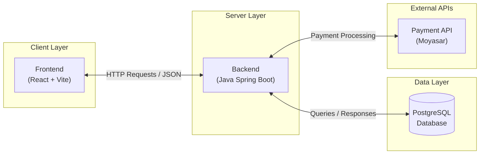

# MVP System Architecture
## 1️⃣ High-Level Package Diagram (Three-Layer Architecture)

```mermaid
flowchart LR
    subgraph Client["Client Layer"]
        FE["Frontend<br/>(React + Vite)"]
    end

    subgraph Server["Server Layer"]
        BE["Backend<br/>(Java Spring Boot)"]
    end

    subgraph Data["Data Layer"]
        DB[(PostgreSQL<br/>Database)]
    end

    subgraph External["External APIs"]
        MOYASAR["Payment API<br/>(Moyasar)"]
    end

    FE <-->|"HTTP Requests / JSON"| BE
    BE <-->|"Queries / Responses"| DB
    BE <-->|"Payment Processing"| MOYASAR
```
