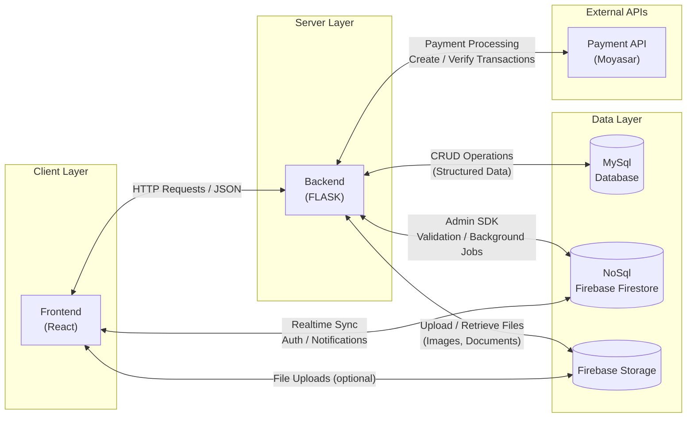
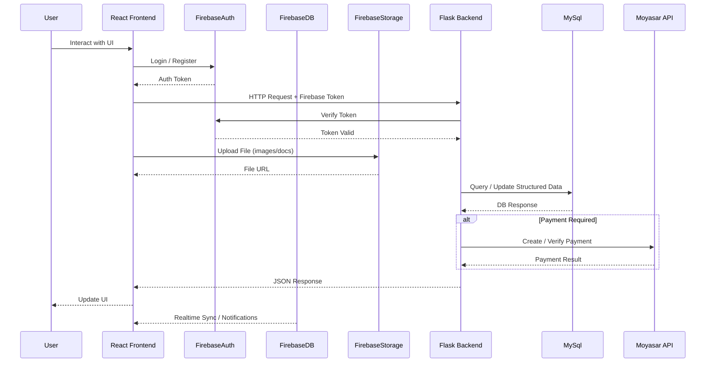

# MVP System Architecture
## 1️⃣ High-Level Package Diagram (Three-Layer Architecture)

## Architecture Overview

The system is structured as a full-stack web platform with a clear separation between components:

| Component | Technology | Description |
|----------|------------|-------------|
| Frontend | React | Single Page Application handling UI and real-time interactions |
| Backend | Flask | REST API server handling business logic, authentication, and system operations |
| Database (SQL) | MySQL | Relational database for structured and transactional data |
| Database (NoSQL) | Firestore | NoSQL database used for real-time sync, notifications, and lightweight data |
| File Storage | Firebase Storage | Cloud storage for images, documents, and user-uploaded files |
| Authentication | Firebase Auth | Token-based authentication and session management |
| Payment Gateway | Moyasar | Secure payment processing for Visa, MasterCard, and Mada |

### Data Flow

